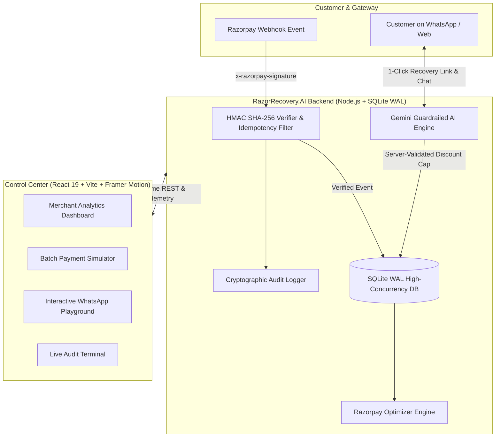

<p align="center">
  
</p>

<h1 align="center">RazorRecovery.AI</h1>

<p align="center">
  <strong>Enterprise Agentic Payment Failure Recovery & Smart Checkout Optimization Platform</strong>
</p>

<p align="center">
  <a href="https://react.dev"></a>
  <a href="https://www.typescriptlang.org/"></a>
  <a href="https://vitejs.dev/"></a>
  <a href="https://razorpay.com"></a>
  <a href="https://nodejs.org"></a>
  <a href="https://owasp.org"></a>
  <a href="#compliance--dpdp-act"></a>
</p>

---

## ⚡ Overview

**RazorRecovery.AI** is an autonomous, production-grade FinTech payment recovery platform tailored for Indian e-commerce, D2C, and subscription platforms integrated with **Razorpay**. 

When a customer's transaction fails due to bank outages, 3D Secure OTP timeouts, or gateway friction, RazorRecovery.AI intercepts the failure webhook, determines the optimal recovery strategy using **Gemini AI & Smart Routing**, and instantly initiates a high-converting, personalized 1-click recovery journey across WhatsApp, SMS, and Email.

---

## 🌟 Key Features

### 🤖 1. Autonomous Conversational AI Recovery Specialist
- **Gemini 3.7 / 3.6 Flash Integration**: Understands customer drop-off context and generates empathetic, conversational explanations in plain language.
- **Strict Financial Guardrails**: Hard-enforces merchant discount caps (e.g., maximum 5–10% discount cap) directly server-side to prevent discount abuse.
- **Deterministic Rule Engine Fallback**: Zero-latency instant fallback engine if external LLM APIs are unreachable.

### 🛡️ 2. Enterprise FinTech Security & DPDP Compliance
- **Mandatory HMAC SHA-256 Signature Verification**: Timing-safe verification (`crypto.timingSafeEqual`) on all incoming Razorpay webhooks to prevent spoofing and forgery.
- **Idempotency & Replay Protection**: Automatic deduplication of webhook events using SHA-256 payload fingerprinting and event tracking.
- **DPDP Act (2023) PII Masking**: Customer emails and phone numbers are masked (`+919876****210` / `r***l@example.com`) across dashboards, API responses, and logs.
- **Customer Opt-Out (STOP) Gate**: Instant compliance honoring when customers express unsubscribe intent (`STOP`, `unsubscribe`, `opt out`).
- **Immutable Cryptographic Audit Trail**: Every recovery link generation, manual injection, and opt-out is logged with client IP and timestamps.

### 🧭 3. Razorpay Optimizer & Smart Routing
- **Failure Telemetry Analysis**: Detects failure error codes (`BAD_REQUEST_AUTHENTICATION_FAILED`, `INSUFFICIENT_FUNDS`, `GATEWAY_ERROR`).
- **Dynamic Routing Recommendations**:
  - Recommends **1-Click UPI Intent** for 3D Secure card friction.
  - Suggests **Cardless EMI / PayLater** for balance limits.
  - Automatically triggers **Backup Acquirer Switch** on gateway drops.

### 📊 4. High-Performance Dashboard & Simulator
- **SQLite WAL Mode Engine**: Zero-dependency, sub-millisecond query execution (`< 1ms`) with pre-compiled prepared statements.
- **Batch Simulator**: Test 50+ concurrent failed payment simulations across various banks and payment methods.
- **Interactive WhatsApp Playground**: Test live conversations, discount negotiations, and instant payment link generation.
- **Live Terminal**: Streaming real-time audit logs and webhook telemetry.

---

## 🏛️ System Architecture



---

## 🚀 Quick Start

### Prerequisites
- **Node.js**: `v20.0.0` or higher
- **npm** or **pnpm**

### 1. Clone the Repository
```bash
git clone https://github.com/sachinn-alt/razor-recovery-app.git
cd razor-recovery-app
```

### 2. Install Dependencies
```bash
npm install
```

### 3. Configure Environment Variables
Copy the `.env.example` file to `.env`:
```bash
cp .env.example .env
```

Edit `.env` with your credentials:
```env
PORT=3001
DEFAULT_MERCHANT_ID=mid_acme_india
RAZORPAY_KEY_ID=rzp_test_YourKeyHere
RAZORPAY_KEY_SECRET=YourSecretHere
RAZORPAY_WEBHOOK_SECRET=whsec_live_razor_test_key_991823
GEMINI_API_KEY=YourGeminiKeyHere
MAX_DISCOUNT_CAP_PERCENT=10
ENABLE_DPDP_PII_MASKING=true
ALLOWED_ORIGINS=http://localhost:5173,http://localhost:3000
```

### 4. Run the Application
Start the backend server:
```bash
npm run server
```

In a second terminal, start the Vite frontend:
```bash
npm run dev
```

Visit **`http://localhost:5173`** in your browser.

---

## 🧪 Security & Verification Test Suite

Run the automated enterprise security and compliance test suite:
```bash
node test_security.js
```

### Test Suite Output:
```text
🧪 Starting RazorRecovery.AI Enterprise FinTech Security & Performance Suite...

  ✅ PASS: Compliance Endpoint returns active security flags
  ✅ PASS: Valid HMAC SHA-256 signature accepted (200 OK)
  ✅ PASS: Replay attack prevented by Idempotency check
  ✅ PASS: Forged HMAC signature strictly rejected (401 Unauthorized)
  ✅ PASS: Missing HMAC signature strictly rejected (401 Unauthorized)
  ✅ PASS: Discount capped at merchant limit (10% max enforced)
  ✅ PASS: Opt-out stopping rule triggered on keyword STOP
  ✅ PASS: Razorpay Optimizer recommends intelligent UPI fallback

🏁 Test Results: 8 passed, 0 failed.
```

---

## 📡 API Reference

| Endpoint | Method | Description | Security / Auth |
| :--- | :---: | :--- | :--- |
| `/api/transactions` | `GET` | Retrieve merchant transactions | DPDP PII Masking, Merchant Context |
| `/api/transactions` | `POST` | Manually inject a failed payment | Payload validation, Audit logged |
| `/api/stats` | `GET` | Real-time recovery rates & volume | Aggregated SQLite query |
| `/api/recovery/generate-link` | `POST` | Generate secure Razorpay payment link | Server-side price & discount cap verification |
| `/api/recovery/chat` | `POST` | Conversational recovery AI assistant | Input sanitization, DPDP STOP opt-out gate |
| `/api/webhooks/razorpay` | `POST` | Razorpay webhook ingestion | Mandatory HMAC SHA-256 & Idempotency check |
| `/api/optimizer/recommend` | `POST` | Intelligent payment route recommendation | Telemetry matrix analysis |
| `/api/compliance/status` | `GET` | Security health & compliance check | Active system flags |
| `/api/audit-logs` | `GET` | View cryptographic audit log history | Immutable audit trail |

---

## 🔒 Compliance & DPDP Act 2023 Alignment

- **Data Minimization**: Raw customer PII is masked before reaching frontend interfaces.
- **Right to Opt-Out**: Automatic detection of consent revocation (`STOP`, `unsubscribe`) halts automated messages immediately.
- **Auditability**: All merchant operations and recovery attempts are stored in an append-only audit log table.
- **PCI-DSS Scope Limitation**: Payment generation uses Razorpay-hosted 1-click links, keeping merchant servers out of PCI-DSS cardholder data scope.

---

## 🛠️ Tech Stack

- **Frontend**: React 19, TypeScript, Vite, Framer Motion, Vanilla CSS Design System
- **Backend**: Node.js Native HTTP Server, SQLite with Write-Ahead Logging (`node:sqlite DatabaseSync`)
- **AI & Reasoning**: Google Gemini API (`gemini-3.7-flash` / `gemini-3.6-flash`), Deterministic Rule Engine
- **Integrations**: Razorpay Payment Links API, Razorpay Webhooks
- **Security Testing**: OWASP Top 10 / Strix Security Suite

---

## 📄 License

Distributed under the **MIT License**.

<p align="center">
  Built with ❤️ for Indian Merchants & Fintech Innovators.
</p>
