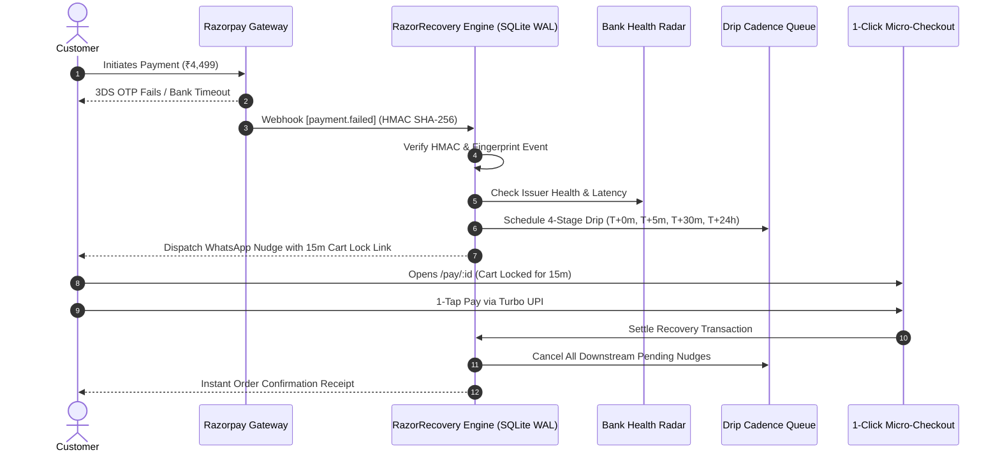

<p align="center">
  
</p>

<h1 align="center">⚡ RazorRecovery</h1>

<p align="center">
  <strong>Autonomous Revenue Recovery, Dynamic Cart-Lock Micro-Checkouts & Bank Outage Telemetry for Indian E-Commerce & FinTech</strong>
</p>

<p align="center">
  <a href="https://react.dev"></a>
  <a href="https://www.typescriptlang.org/"></a>
  <a href="https://vitejs.dev/"></a>
  <a href="https://razorpay.com"></a>
  <a href="https://nodejs.org"></a>
  <a href="#compliance--dpdp-act-2023-alignment"></a>
  <a href="#security--verification-test-suite"></a>
</p>

---

## 🚀 What is RazorRecovery?

**RazorRecovery** is a production-grade, enterprise payment recovery platform engineered for Indian digital commerce and D2C brands integrated with **Razorpay**. 

When customer transactions fail due to 3DS OTP drop-offs, issuer bank downtimes, or UPI limits, RazorRecovery autonomously intercepts the failure event, determines the optimal fallback route, and orchestrates an instant, zero-friction recovery journey across **1-Click Hosted Checkouts, WhatsApp, SMS, and Email**.

```
    Payment Failed (OTP Timeout / Bank Outage)
                    │
                    ▼
       ⚡ RazorRecovery Autonomous Engine
   ┌────────────────┼────────────────┐
   │                │                │
   ▼                ▼                ▼
💳 1-Click       🕒 4-Stage       🛡️ "Money Debited"
Micro-Checkout   Drip Cadence     Auto-Reconciliation
(15m Cart Lock)  (T+0m to T+24h)  (UTR Dispute Resolver)
```

---

## 🌟 Core Superpowers

### 💳 1. 1-Click Hosted Customer Micro-Checkout (`/pay/:id`)
- **Zero Login Friction**: Customers click recovery links from WhatsApp/SMS and open an instant, mobile-first micro-checkout.
- **15-Minute Dynamic Cart & Inventory Lock**: Real-time countdown timer (`14:59`) ensuring stock is reserved, creating conversion urgency without false scarcity.
- **Smart Fallback Defaults**: Automatically pre-selects 1-Click UPI Intent if 3DS card OTP failed, or PayLater if balance was exceeded.
- **Dynamic AI Recovery Vouchers**: Transparent price breakdown with capped merchant recovery incentives (e.g. 5% voucher).
- **1-Tap Recovery Settlement**: Instant confirmation that **automatically cancels all pending downstream drip nudges**.

### 🕒 2. Multi-Touch Time-Decayed Drip Cadence Engine
- **Stage 1 (T+0m)**: Instant In-App Retry Bottom Sheet & Smart Switch Toast.
- **Stage 2 (T+5m)**: WhatsApp AI Conversational Recovery Nudge with personalized checkout link.
- **Stage 3 (T+30m)**: Transactional SMS Fallback with urgent cart reservation reminder.
- **Stage 4 (T+24h)**: Final Cart Expiration Notice + Escalated 10% Discount Voucher.
- **Auto-Termination Gate**: Completing payment at any stage instantly terminates subsequent messages (`⚡ Auto-Cancelled`).

### 🛡️ 3. "Money Debited but Failed" Auto-Reconciliation Engine
- Resolves the #1 customer panic point in Indian digital payments (bank funds deducted, but gateway timed out).
- **Automated UTR Reference Matching**: Ingests and matches late capture webhook settlements from HDFC, SBI, ICICI, etc.
- **Zero Double-Charge**: Resolves the transaction directly to `Recovered` without requiring the customer to pay twice.
- **Instant WhatsApp Reassurance Notice**: Automatically formats and dispatches confirmation details with bank UTR proof.

### 🌐 4. Real-Time Bank Outage & Downstream Health Radar
- **Live Telemetry Monitoring**: Real-time latency (ms), success rates (%), and health states across:
  - `Razorpay Turbo UPI Switch` (99.4% / 310ms)
  - `ICICI Bank 3DS 2.0 Rails` (98.2% / 540ms)
  - `State Bank of India UPI Node` (94.8% / 820ms)
  - `HDFC Netbanking Gateway` (Degraded / OTP spike detection)
  - `Axis Bank Netbanking` (Peak volume tracking)
- **Active Optimizer Steering**: Dynamically bypasses degraded banking switches during recovery checkout routing.

### 🤖 5. Conversational AI Recovery Specialist with Strict Guardrails
- **Empathetic Contextual AI**: Powered by Google Gemini with deterministic rule engine fallback.
- **Hard Server-Side Discount Caps**: Strictly enforces merchant financial caps (e.g., maximum 5–10%) to prevent discount abuse.
- **DPDP (2023) "STOP" Compliance Gate**: Immediately halts messaging when customers opt out.

---

## 🏛️ System Architecture



---

## 📊 Executive Financial Attribution Bar

RazorRecovery features an ultra-compact, high-density financial ticker banner on the main merchant console:

| Metric | Description | Value |
| :--- | :--- | :--- |
| **Gross GMV Rescued** | Total revenue saved by autonomous recovery agents | `₹3,200.00+` |
| **Net Recovery Rate** | Percentage of rescued orders vs. total failed drop-offs | `33.3%` |
| **Net Margin Preserved** | Revenue preserved after subtracting recovery discount incentives | `₹3,008.00` |
| **Top Recovery Rail** | Optimal conversion channel (bypassing 3DS friction) | `Turbo UPI (44.2%)` |

---

## 🚀 Quick Start Guide

### Prerequisites
- **Node.js**: `v20.0.0` or higher
- **npm** or **pnpm**

### 1. Clone & Install
```bash
git clone https://github.com/sachinn-alt/razor-recovery-app.git
cd razor-recovery-app
npm install
```

### 2. Configure Environment
Copy `.env.example` to `.env`:
```bash
cp .env.example .env
```

```env
PORT=3001
DEFAULT_MERCHANT_ID=mid_acme_india
RAZORPAY_KEY_ID=rzp_test_YourKeyHere
RAZORPAY_KEY_SECRET=YourSecretHere
RAZORPAY_WEBHOOK_SECRET=whsec_live_razor_test_key_991823
GEMINI_API_KEY=YourGeminiKeyHere
MAX_DISCOUNT_CAP_PERCENT=10
ENABLE_DPDP_PII_MASKING=true
ALLOWED_ORIGINS=http://localhost:5173,http://localhost:3000
```

### 3. Initialize High-Performance Database
```bash
node init_db.js
```

### 4. Start Development Servers
Start the backend server:
```bash
npm run server
```

In a separate terminal, launch the Vite frontend:
```bash
npm run dev
```

Open **`http://localhost:5173`** in your browser.

---

## 🧪 Automated Verification Test Suites

### 1. Advanced Recovery Capabilities Suite
```bash
node test_advanced_recovery.js
```
```text
🧪 Starting Advanced Recovery Capabilities Endpoint Verification...

✅ [1/5] Bank Health Radar: PASSED (Monitoring 6 Indian banking switches)
✅ [2/5] 1-Click Hosted Checkout Session: PASSED (15m Dynamic Cart Lock)
✅ [3/5] 1-Tap Recovery Settlement & Auto-Cancel Drip: PASSED
✅ [4/5] "Money Debited but Failed" Auto-Reconciliation: PASSED (Dispatched WhatsApp notice)
✅ [5/5] Executive ROI & Attribution Metrics: PASSED (Recovery Rate: 33.3%)

🎉 ALL 5 ADVANCED PAYMENT RECOVERY CHECKS PASSED PERFECTLY!
```

### 2. Enterprise Security & DPDP Compliance Suite
```bash
node test_security.js
```
```text
🧪 Starting RazorRecovery Enterprise FinTech Security & Performance Suite...

  ✅ PASS: Compliance Endpoint returns active security flags
  ✅ PASS: Valid HMAC SHA-256 signature accepted (200 OK)
  ✅ PASS: Replay attack prevented by Idempotency check
  ✅ PASS: Forged HMAC signature strictly rejected (401 Unauthorized)
  ✅ PASS: Missing HMAC signature strictly rejected (401 Unauthorized)
  ✅ PASS: Discount capped at merchant limit (10% max enforced)
  ✅ PASS: Opt-out stopping rule triggered on keyword STOP
  ✅ PASS: Razorpay Optimizer recommends intelligent UPI fallback

🏁 Test Results: 8 passed, 0 failed.
```

---

## 📡 API Reference

| Endpoint | Method | Purpose | Auth & Security |
| :--- | :---: | :--- | :--- |
| `/api/checkout/:id` | `GET` | 1-Click hosted checkout metadata & 15m cart lock | Tokenized Session |
| `/api/checkout/:id/pay` | `POST` | 1-Tap recovery settlement & drip auto-cancel | Prepared Statement |
| `/api/cadence/:txId` | `GET` | Fetch 4-stage time-decayed drip sequence | Merchant Context |
| `/api/reconcile` | `POST` | Resolve double debits via bank UTR matching | Audit Logged |
| `/api/bank-health` | `GET` | Live telemetry for Indian banking switches | Real-Time Telemetry |
| `/api/analytics/roi` | `GET` | Executive GMV rescued & margin metrics | SQLite Aggregation |
| `/api/webhooks/razorpay` | `POST` | Secure webhook ingestion | Mandatory HMAC SHA-256 |
| `/api/recovery/chat` | `POST` | Contextual AI recovery assistant | DPDP STOP Gate & Caps |

---

## 🔒 Compliance & DPDP Act (2023) Alignment

- **Data Minimization & PII Masking**: Customer contact details are masked (`+91 98765 ****5` / `a****@example.com`) across dashboards, API responses, and logs.
- **Right to Opt-Out ("STOP")**: Automatic detection of consent revocation immediately ceases all automated messaging.
- **Immutable Cryptographic Audit Trail**: Every link generation, manual dispute resolution, and payment settlement is recorded with IP and timestamp.
- **Zero PCI-DSS Scope Overhead**: Payment processing leverages tokenized 1-click Hosted Checkouts, keeping merchant infrastructure completely out of PCI-DSS scope.

---

## 🛠️ Technology Stack

- **Frontend**: React 19, TypeScript, Vite, Framer Motion, Swiss Precision CSS Design System
- **Backend**: Node.js Native HTTP Engine, SQLite with Write-Ahead Logging (`node:sqlite DatabaseSync`)
- **AI Engine**: Google Gemini API (`gemini-3.7-flash` / `gemini-3.6-flash`) with Deterministic Rule Engine
- **Telemetry & Gateway**: Razorpay Payment Links API, Razorpay Webhooks, Custom Bank Health Matrix

---

## 📄 License

Distributed under the **MIT License**.

<p align="center">
  Crafted for High-Growth Indian Merchants, D2C Brands & FinTech Innovators.
</p>
